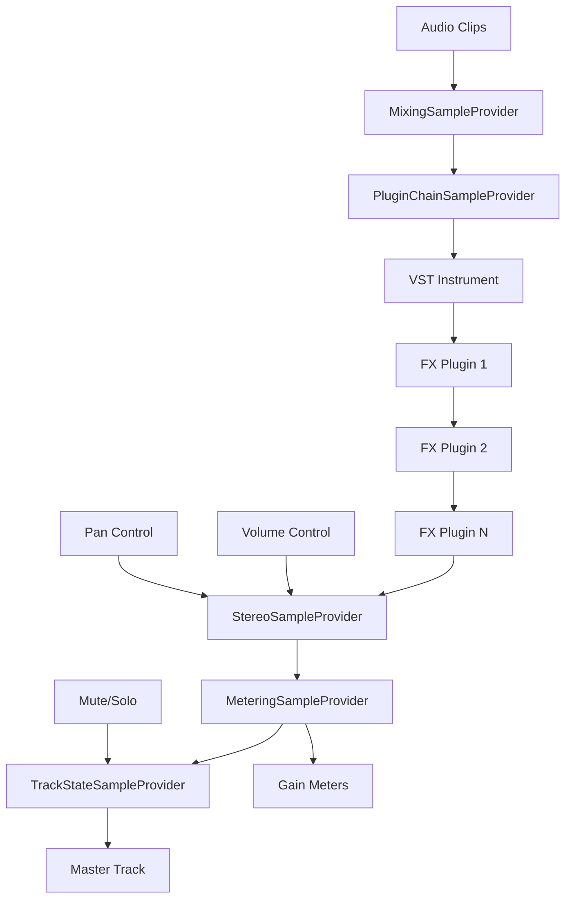

## Overview

The audio engine is the core of Lumix's audio system, handling everything from clip playback to effects processing, volume control, and recording. Each track has its own engine instance that processes audio independently before routing to the master output.

## Architecture

The audio engine uses a signal chain architecture built on NAudio's sample provider model.

<Steps>
  <Step title="Mixer">
    Combines multiple audio clips playing simultaneously
  </Step>
  <Step title="Plugin Chain">
    Processes audio through VST and built-in effects
  </Step>
  <Step title="Stereo Processing">
    Applies volume and pan controls
  </Step>
  <Step title="Metering">
    Measures audio levels for visualization
  </Step>
  <Step title="Track State">
    Handles mute/solo functionality
  </Step>
</Steps>

## TrackAudioEngine Class

The `TrackAudioEngine` class (~/workspace/source/Lumix/Tracks/AudioTracks/TrackAudioEngine.cs:12) extends `TrackEngine` and implements the complete audio processing chain.

### Signal Chain Components

```csharp
public TrackAudioEngine(AudioTrack audioTrack, int sampleRate = 44100, int channelCount = 2)
{
    // 1. Mixer - combines all playing clips
    Mixer = new MixingSampleProvider(
        WaveFormat.CreateIeeeFloatWaveFormat(sampleRate, channelCount)
    ) {
        ReadFully = true
    };

    // 2. Plugin Chain - VST and built-in effects
    PluginChainSampleProvider = new PluginChainSampleProvider(Mixer);

    // 3. Stereo Processing - volume and pan
    StereoSampleProvider = new StereoSampleProvider(PluginChainSampleProvider);

    // 4. Metering - level measurement
    MeteringSampleProvider = new MeteringSampleProvider(StereoSampleProvider, 100);
    MeteringSampleProvider.StreamVolume += (s, e) => VolumeMeasured?.Invoke(this, e);

    // 5. Track State - mute/solo handling
    TrackStateSampleProvider = new TrackStateSampleProvider(
        MeteringSampleProvider, 
        audioTrack
    );
}
```

### Key Properties

| Property | Type | Description |
|----------|------|-------------|
| `Mixer` | `MixingSampleProvider` | Combines multiple audio sources |
| `PluginChainSampleProvider` | `PluginChainSampleProvider` | Effects processing chain |
| `StereoSampleProvider` | `StereoSampleProvider` | Volume and pan control |
| `MeteringSampleProvider` | `MeteringSampleProvider` | Audio level measurement |
| `TrackStateSampleProvider` | `TrackStateSampleProvider` | Mute/solo handling |
| `IsRecording` | `bool` | Current recording state |

## Audio Playback

### Firing Clips

When a clip starts playing:

```csharp
public override void Fire(AudioFileReader audioFile, float offset, float endOffset)
{
    // Create new instance for this playback
    var input = new AudioFileReader(audioFile.FileName);
    
    // Seek to start offset
    input.CurrentTime = TimeSpan.FromSeconds(offset);
    
    // Wrap in offset provider
    var sample = new OffsetSampleProvider(input);
    
    // Limit duration based on end offset
    var finalSample = sample.Take(
        TimeSpan.FromSeconds(input.TotalTime.TotalSeconds - endOffset - offset)
    );
    
    // Verify format compatibility
    if (!Mixer.WaveFormat.Equals(finalSample.WaveFormat))
    {
        User32.MessageBox(IntPtr.Zero, 
            $"Can't play {Path.GetFileName(input.FileName)}", 
            "WaveFormat exception", 
            User32.MB_FLAGS.MB_ICONWARNING | User32.MB_FLAGS.MB_TOPMOST
        );
        return;
    }
    
    // Add to mixer
    Mixer.AddMixerInput(ConvertToRightChannelCount(finalSample));
}
```

<Note>
  Each playback creates a new `AudioFileReader` instance. This allows the same clip to play multiple times simultaneously or be triggered again before finishing.
</Note>

### Channel Conversion

The engine automatically handles channel count mismatches:

```csharp
private ISampleProvider ConvertToRightChannelCount(ISampleProvider input)
{
    if (input.WaveFormat.Channels == Mixer.WaveFormat.Channels)
    {
        return input;
    }
    
    if (input.WaveFormat.Channels == 1 && Mixer.WaveFormat.Channels == 2)
    {
        return new MonoToStereoSampleProvider(input);
    }
    
    throw new NotImplementedException(
        "Not yet implemented this channel count conversion"
    );
}
```

Currently supported:
- **Stereo → Stereo**: Pass-through
- **Mono → Stereo**: Automatic conversion
- **Other configurations**: Not yet implemented

## Plugin Processing

### PluginChainSampleProvider

The `PluginChainSampleProvider` (~/workspace/source/Lumix/Plugins/PluginChainSampleProvider.cs:8) manages the effects chain.

#### Plugin Types

```csharp
private IAudioProcessor _pluginInstrument;  // VSTi for MIDI tracks
private List<IAudioProcessor> _fxPlugins;   // Effects chain
```

- **Instrument Plugin**: Single VSTi for MIDI tracks (ignored on audio tracks)
- **FX Plugins**: Chain of effects applied in order

#### Default Plugins

Every track starts with:
```csharp
private List<IAudioProcessor> _fxPlugins = new() 
{ 
    new UtilityPlugin(),    // Gain, phase, and utility functions
    new SimpleEqPlugin()    // Basic EQ
};
```

### Adding Plugins

```csharp
public void AddPlugin(IAudioProcessor plugin)
{
    if (plugin is VstAudioProcessor vstPlugin && 
        vstPlugin.VstPlugin.PluginType == VstType.VSTi)
    {
        // Dispose existing instrument
        if (_pluginInstrument != null && 
            _pluginInstrument is VstAudioProcessor currentVstInstrument)
        {
            currentVstInstrument.DeleteRequested = true;
            currentVstInstrument.VstPlugin.Dispose(
                vstPlugin.VstPlugin.PluginWindow.Handle != 
                currentVstInstrument.VstPlugin.PluginWindow.Handle
            );
        }
        _pluginInstrument = plugin;
    }
    else
    {
        _fxPlugins.Add(plugin);
    }
}
```

### Audio Processing

```csharp
public int Read(float[] buffer, int offset, int count)
{
    int samplesRead = source.Read(buffer, offset, count);

    // Process VSTi (for MIDI tracks)
    if (_pluginInstrument != null && _pluginInstrument.Enabled)
    {
        ProcessAudio(_pluginInstrument, ref buffer, offset, count, samplesRead);
    }

    // Process effects chain in order
    foreach (var plugin in _fxPlugins.ToList())
    {
        if (!plugin.Enabled)
            continue;
            
        ProcessAudio(plugin, ref buffer, offset, count, samplesRead);
    }

    return samplesRead;
}
```

<Warning>
  Plugin processing happens in-place. Each plugin receives the output of the previous plugin in the chain. Order matters!
</Warning>

### Plugin Management

```csharp
// Remove specific plugin
public void RemovePlugin(IAudioProcessor target)
{
    if (target == _pluginInstrument)
    {
        if (target is VstAudioProcessor vstInstrument)
        {
            vstInstrument.DeleteRequested = true;
            vstInstrument.VstPlugin.Dispose();
        }
        _pluginInstrument = null;
    }
    else
    {
        _fxPlugins.Remove(target);
        if (target is VstAudioProcessor vstFxPlugin)
        {
            vstFxPlugin.DeleteRequested = true;
            vstFxPlugin.VstPlugin.Dispose();
        }
    }
}

// Clear all plugins
public void RemoveAllPlugins()
{
    // Dispose instrument
    if (_pluginInstrument is VstAudioProcessor vstInstrument)
    {
        vstInstrument.DeleteRequested = true;
        vstInstrument.VstPlugin.Dispose();
    }
    _pluginInstrument = null;

    // Dispose all effects
    foreach (var fxPlugin in _fxPlugins.ToList())
    {
        _fxPlugins.Remove(fxPlugin);
        if (fxPlugin is VstAudioProcessor vstFxPlugin)
        {
            vstFxPlugin.DeleteRequested = true;
            vstFxPlugin.VstPlugin.Dispose();
        }
    }
}
```

## Stereo Processing

### StereoSampleProvider

The `StereoSampleProvider` (~/workspace/source/Lumix/SampleProviders/StereoSampleProvider.cs:5) handles volume and pan controls.

```csharp
public class StereoSampleProvider : ISampleProvider
{
    public float LeftVolume { get; set; } = 1.0f;
    public float RightVolume { get; set; } = 1.0f;
    public float Pan { get; set; } = 0.0f; // -1.0f (left) to 1.0f (right)

    public int Read(float[] buffer, int offset, int count)
    {
        int samplesRead = source.Read(buffer, offset, count);
        
        for (int i = 0; i < samplesRead; i += 2)
        {
            float left = buffer[offset + i];
            float right = buffer[offset + i + 1];

            // Calculate pan factors
            float panLeft = Pan <= 0 ? 1.0f : 1.0f - Pan;
            float panRight = Pan >= 0 ? 1.0f : 1.0f + Pan;

            // Apply volume and panning
            buffer[offset + i] = left * LeftVolume * panLeft;
            buffer[offset + i + 1] = right * RightVolume * panRight;
        }
        
        return samplesRead;
    }

    public void SetGain(float gain)
    {
        LeftVolume = gain;
        RightVolume = gain;
    }
}
```

### Pan Law

The pan implementation uses a simple linear pan law:
- **Center (0.0)**: Both channels at full volume
- **Left (-1.0)**: Left channel at full, right channel at 0
- **Right (1.0)**: Right channel at full, left channel at 0

<CodeGroup>
```csharp Pan Left (-1.0)
panLeft = 1.0f;  // Full left
panRight = 0.0f; // Silence right
```

```csharp Pan Center (0.0)
panLeft = 1.0f;  // Full left
panRight = 1.0f; // Full right
```

```csharp Pan Right (1.0)
panLeft = 0.0f;  // Silence left
panRight = 1.0f; // Full right
```
</CodeGroup>

## Audio Recording

### Starting Recording

```csharp
public override void StartRecording()
{
    // Generate unique filename
    _tmpRecordId = Guid.NewGuid().ToString() + ".wav";

    // Create input device
    inputDevice = new WaveInEvent
    {
        WaveFormat = new WaveFormat(
            Mixer.WaveFormat.SampleRate, 
            Mixer.WaveFormat.Channels
        )
    };

    // Create file writer
    waveFileWriter = new WaveFileWriter(_tmpRecordId, inputDevice.WaveFormat);

    // Wire up data handling
    inputDevice.DataAvailable += (s, e) =>
    {
        waveFileWriter.Write(e.Buffer, 0, e.BytesRecorded);
        waveFileWriter.Flush();
    };

    // Start capture
    inputDevice.StartRecording();
    IsRecording = true;
}
```

### Stopping Recording

```csharp
public override void StopRecording(Track destTrack)
{
    // Stop and dispose input device
    if (inputDevice != null)
    {
        inputDevice.StopRecording();
        inputDevice.Dispose();
        inputDevice = null;
    }

    // Close file writer
    if (waveFileWriter != null)
    {
        waveFileWriter.Dispose();
        waveFileWriter = null;
    }

    IsRecording = false;
    
    // Create clip from recorded file
    var audioClip = new AudioClip(
        destTrack as AudioTrack, 
        new AudioClipData(_tmpRecordId), 
        0
    );
    destTrack.Clips.Add(audioClip);
}
```

<Note>
  Recording creates a temporary WAV file that is automatically added to the track as a clip when recording stops.
</Note>

## Volume Metering

The metering system provides real-time audio level feedback.

### Event System

```csharp
public override event EventHandler<StreamVolumeEventArgs> VolumeMeasured;

// Wired up during construction:
MeteringSampleProvider.StreamVolume += (s, e) => 
    VolumeMeasured?.Invoke(this, e);
```

### Usage in AudioTrack

```csharp
Engine.VolumeMeasured += (sender, e) =>
{
    _leftChannelGain = e.MaxSampleValues[0];
    _rightChannelGain = e.MaxSampleValues[1];
};
```

The measured values are:
- Normalized to 0.0-1.0 range
- Updated at regular intervals (100ms by default)
- Available per-channel for stereo metering

## Stopping Playback

When playback stops or the timeline is stopped:

```csharp
public override void StopSounds()
{
    Mixer.RemoveAllMixerInputs();
}
```

This immediately clears all playing audio sources from the mixer, ensuring clean stop without artifacts.

## Best Practices

<AccordionGroup>
  <Accordion title="Format Compatibility">
    Ensure all audio files match the project sample rate and channel count. The engine will warn about incompatible formats but won't auto-convert.
  </Accordion>
  
  <Accordion title="Plugin Order">
    Order your plugin chain carefully:
    1. Dynamics (compression, gates) first
    2. EQ in the middle
    3. Time-based effects (reverb, delay) last
  </Accordion>
  
  <Accordion title="Recording">
    - Check input device settings before recording
    - Monitor levels to avoid clipping
    - Recording creates WAV files at project sample rate
  </Accordion>
  
  <Accordion title="Performance">
    - Disable unused plugins to save CPU
    - Use built-in plugins when possible (lighter than VSTs)
    - Monitor the effects chain complexity
  </Accordion>
</AccordionGroup>

## Signal Flow Diagram



## Related Components

- **Base Engine Class**: `~/workspace/source/Lumix/Tracks/TrackEngine.cs`
- **Stereo Provider**: `~/workspace/source/Lumix/SampleProviders/StereoSampleProvider.cs`
- **Plugin Chain**: `~/workspace/source/Lumix/Plugins/PluginChainSampleProvider.cs`

## Next Steps

<CardGroup cols={2}>
  <Card title="Audio Tracks" icon="list" href="/audio/audio-tracks">
    Learn how tracks use the audio engine
  </Card>
  <Card title="Audio Clips" icon="waveform" href="/audio/audio-clips">
    Understand clip playback integration
  </Card>
</CardGroup>