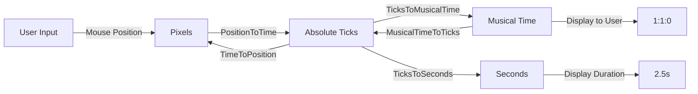

Lumix uses a musical time format called **Bars:Beats:Ticks** (also known as BBT) to represent positions and durations in a musically meaningful way.

## The MusicalTime Structure

Musical time is represented by a simple struct:

```csharp Lumix/MusicalTime.cs
public struct MusicalTime
{
    public int Bars;
    public int Beats;
    public int Ticks;

    public MusicalTime(int bars, int beats, int ticks)
    {
        this.Bars = bars;
        this.Beats = beats;
        this.Ticks = ticks;
    }
}
```

### Components

<CardGroup cols={3}>
  <Card title="Bars" icon="chart-bar">
    The measure number (one bar = one measure of music)
  </Card>
  <Card title="Beats" icon="drum">
    The beat within the current bar (depends on time signature)
  </Card>
  <Card title="Ticks" icon="stopwatch">
    Sub-beat divisions for precise timing (960 ticks per beat)
  </Card>
</CardGroup>

## Understanding Ticks

Lumix uses **960 PPQ** (Pulses Per Quarter note) resolution:

```csharp Lumix/Views/Arrangement/TimeLineV2.cs
public const int PPQ = 960;
```

<Info>
  **960 PPQ** means each quarter note (beat) is divided into 960 ticks, providing extremely precise timing:
  - 1 beat = 960 ticks
  - 1 sixteenth note = 240 ticks (960 ÷ 4)
  - 1 thirty-second note = 120 ticks (960 ÷ 8)
  - 1 triplet = 320 ticks (960 ÷ 3)
</Info>

## Time Signature Support

The default time signature is 4/4:

```csharp Lumix/Views/Arrangement/TimeLineV2.cs
public static float BeatsPerBar { get; set; } = 4; // Default 4/4 time signature
```

This means:
- 1 bar = 4 beats
- 1 beat = 1 quarter note
- 1 bar = 3840 ticks (4 × 960)

## Arithmetic Operations

The `MusicalTime` struct supports standard arithmetic operations:

### Addition

```csharp Lumix/MusicalTime.cs
public static MusicalTime operator +(MusicalTime a, MusicalTime b)
{
    return new MusicalTime(a.Bars + b.Bars, a.Beats + b.Beats, a.Ticks + b.Ticks);
}
```

<Note>
  Addition is performed component-wise. You may need to normalize the result if beats exceed the bar length or ticks exceed 960.
</Note>

### Subtraction

```csharp Lumix/MusicalTime.cs
public static MusicalTime operator -(MusicalTime a, MusicalTime b)
{
    return new MusicalTime(a.Bars - b.Bars, a.Beats - b.Beats, a.Ticks - b.Ticks);
}
```

### Multiplication

```csharp Lumix/MusicalTime.cs
public static MusicalTime operator *(MusicalTime a, MusicalTime b)
{
    return new MusicalTime(a.Bars * b.Bars, a.Beats * b.Beats, a.Ticks * b.Ticks);
}
```

### Division

```csharp Lumix/MusicalTime.cs
public static MusicalTime operator /(MusicalTime a, MusicalTime b)
{
    return new MusicalTime(a.Bars / b.Bars, a.Beats / b.Beats, a.Ticks / b.Ticks);
}
```

## Comparison Operations

Musical times can be compared:

### Greater Than

```csharp Lumix/MusicalTime.cs
public static bool operator >(MusicalTime a, MusicalTime b)
{
    if (a.Bars > b.Bars) return true;
    if (a.Bars == b.Bars && a.Beats > b.Beats) return true;
    if (a.Bars == b.Bars && a.Beats == b.Beats && a.Ticks > b.Ticks) return true;
    return false;
}
```

Comparisons are performed hierarchically: Bars → Beats → Ticks.

### Less Than

```csharp Lumix/MusicalTime.cs
public static bool operator <(MusicalTime a, MusicalTime b)
{
    if (a.Bars < b.Bars) return true;
    if (a.Bars == b.Bars && a.Beats < b.Beats) return true;
    if (a.Bars == b.Bars && a.Beats == b.Beats && a.Ticks < b.Ticks) return true;
    return false;
}
```

### Equality

```csharp Lumix/MusicalTime.cs
public static bool operator ==(MusicalTime a, MusicalTime b)
{
    return a.Bars == b.Bars && a.Beats == b.Beats && a.Ticks == b.Ticks;
}

public static bool operator !=(MusicalTime a, MusicalTime b)
{
    return !(a == b);
}
```

### Greater/Less Than or Equal

```csharp Lumix/MusicalTime.cs
public static bool operator >=(MusicalTime a, MusicalTime b)
{
    return a > b || a == b;
}

public static bool operator <=(MusicalTime a, MusicalTime b)
{
    return a < b || a == b;
}
```

## Converting to Musical Time

The timeline provides conversion from absolute ticks:

```csharp Lumix/Views/Arrangement/TimeLineV2.cs
public static MusicalTime TicksToMusicalTime(long ticks, bool applyOffset = false)
{
    // Ticks per bar and beat
    int ticksPerBar = 4 * PPQ; // 3840 ticks
    int ticksPerBeat = PPQ;     // 960 ticks

    // Calculate bars
    int bars = (int)(ticks / ticksPerBar);
    long remainingTicksAfterBars = ticks % ticksPerBar;

    // Calculate beats
    int beats = (int)(remainingTicksAfterBars / ticksPerBeat);
    long remainingTicksAfterBeats = remainingTicksAfterBars % ticksPerBeat;

    // Remaining ticks
    int ticksRemainder = (int)remainingTicksAfterBeats;

    if (applyOffset)
    {
        // Offset bars, beats, and ticks to start at 1:1:1
        return new MusicalTime(bars + 1, beats + 1, ticksRemainder + 1);
    }
    return new MusicalTime(bars, beats, ticksRemainder);
}
```

### Zero-Based vs One-Based

<Info>
  Musical time can be represented in two ways:
  - **Zero-based**: Internal representation starts at 0:0:0
  - **One-based**: User-facing display starts at 1:1:1
  
  Use `applyOffset: true` when displaying to users, `false` for internal calculations.
</Info>

## Converting from Musical Time

Convert musical time back to absolute ticks:

```csharp Lumix/Views/Arrangement/TimeLineV2.cs
public static long MusicalTimeToTicks(MusicalTime musicalTime, bool applyOffset = false)
{
    int ticksPerBar = 4 * PPQ;  // 3840 ticks
    int ticksPerBeat = PPQ;      // 960 ticks

    if (applyOffset)
    {
        // Subtract 1 to match the offset logic
        return ((musicalTime.Bars - 1) * ticksPerBar) + ((musicalTime.Beats - 1) * ticksPerBeat) + (musicalTime.Ticks - 1);
    }
    return ((musicalTime.Bars) * ticksPerBar) + ((musicalTime.Beats) * ticksPerBeat) + (musicalTime.Ticks);
}
```

## Practical Examples

### Example 1: Displaying Clip Position

```csharp
var clip = GetClip();
MusicalTime start = clip.StartMusicalTime;
Console.WriteLine($"Clip starts at {start.Bars}:{start.Beats}:{start.Ticks}");

// Example output: "Clip starts at 5:3:480"
// This means: Bar 5, Beat 3, 480 ticks into that beat (halfway through)
```

### Example 2: Calculating Duration

```csharp
MusicalTime start = new MusicalTime(1, 1, 0);   // Bar 1, Beat 1, Tick 0
MusicalTime end = new MusicalTime(3, 2, 480);   // Bar 3, Beat 2, Tick 480

MusicalTime duration = end - start;
Console.WriteLine($"Duration: {duration.Bars} bars, {duration.Beats} beats, {duration.Ticks} ticks");

// Convert to absolute ticks for precise calculation
long startTicks = TimeLineV2.MusicalTimeToTicks(start, applyOffset: true);
long endTicks = TimeLineV2.MusicalTimeToTicks(end, applyOffset: true);
long durationTicks = endTicks - startTicks;

Console.WriteLine($"Total duration: {durationTicks} ticks");
```

### Example 3: Time Selection Display

```csharp Lumix/Tracks/Track.cs
MusicalTime selectionLength = TimeSelectionArea.Length;
UiElement.Tooltip($"Time Selection\nStart: {TimeSelectionArea.Start.Bars}.{TimeSelectionArea.Start.Beats}.{TimeSelectionArea.Start.Ticks}\n" +
    $"End: {TimeSelectionArea.End.Bars}.{TimeSelectionArea.End.Beats}.{TimeSelectionArea.End.Ticks}\n" +
    $"Length: {selectionLength.Bars}.{selectionLength.Beats}.{selectionLength.Ticks} (Duration: {TimeLineV2.TicksToSeconds(TimeLineV2.MusicalTimeToTicks(selectionLength)):n1}s)");
```

### Example 4: Snapping to Musical Boundaries

```csharp
// Get current mouse position in ticks
float mouseX = ImGui.GetMousePos().X - ArrangementView.WindowPos.X;
long ticksAtMouse = TimeLineV2.PositionToTime(mouseX);

// Convert to musical time
MusicalTime musicalTime = TimeLineV2.TicksToMusicalTime(ticksAtMouse, applyOffset: true);

// Snap to nearest bar
musicalTime.Beats = 1;
musicalTime.Ticks = 1;

// Convert back to ticks
long snappedTicks = TimeLineV2.MusicalTimeToTicks(musicalTime, applyOffset: true);
```

## Common Musical Divisions

Here are common note values in ticks (at 960 PPQ):

| Note Value | Ticks | Calculation |
|------------|-------|-------------|
| Whole note | 3840 | 960 × 4 |
| Half note | 1920 | 960 × 2 |
| Quarter note | 960 | 960 × 1 |
| Eighth note | 480 | 960 ÷ 2 |
| Sixteenth note | 240 | 960 ÷ 4 |
| Thirty-second note | 120 | 960 ÷ 8 |
| Quarter note triplet | 320 | 960 ÷ 3 |
| Eighth note triplet | 160 | 480 ÷ 3 |

<Note>
  The high resolution of 960 PPQ allows for accurate representation of triplets and other complex subdivisions without rounding errors.
</Note>

## Time Selection Class

Lumix provides a `TimeSelection` class for managing time ranges:

```csharp Lumix/TimeSelection.cs
public class TimeSelection
{
    public MusicalTime Start { get; private set; }
    public MusicalTime End { get; private set; }
    public MusicalTime Length => End - Start;

    public void SetStart(MusicalTime start) => Start = start;
    public void SetEnd(MusicalTime end) => End = end;
    public void AddToStart(MusicalTime time) => Start += time;
    public void AddToEnd(MusicalTime time) => End += time;
    public void SubFromStart(MusicalTime time) => Start -= time;
    public void SubFromEnd(MusicalTime time) => End -= time;
    public bool HasArea() => Start != End;
    
    public void Reset()
    {
        Start = TimeLineV2.TicksToMusicalTime(TimeLineV2.GetLastTickStart(), true);
        End = TimeLineV2.TicksToMusicalTime(TimeLineV2.GetLastTickStart(), true);
    }
}
```

### Usage Example

```csharp
var selection = new TimeSelection();
selection.SetStart(new MusicalTime(1, 1, 0));
selection.SetEnd(new MusicalTime(5, 1, 0));

if (selection.HasArea())
{
    MusicalTime length = selection.Length;
    Console.WriteLine($"Selected {length.Bars} bars");
}
```

## Best Practices

<Steps>
  <Step title="Use Ticks Internally">
    Perform all calculations in absolute ticks for accuracy, convert to musical time only for display
  </Step>
  <Step title="Apply Offset for Display">
    Always use `applyOffset: true` when showing times to users (1:1:1 instead of 0:0:0)
  </Step>
  <Step title="Normalize After Arithmetic">
    After adding or subtracting musical times, convert to ticks and back to normalize the values
  </Step>
  <Step title="Consider Time Signature">
    Remember that bars and beats are time-signature dependent
  </Step>
</Steps>

## Conversion Workflow



## See Also

<CardGroup cols={2}>
  <Card title="Timeline" href="/core-concepts/timeline" icon="timeline">
    Learn about timeline management and playback
  </Card>
  <Card title="Clips" href="/core-concepts/clips" icon="scissors">
    Understanding clip time properties
  </Card>
</CardGroup>
