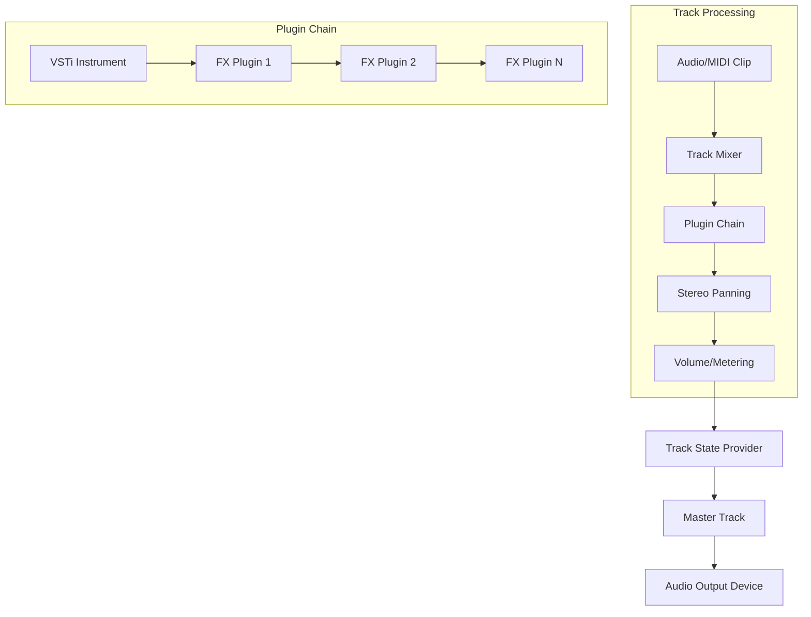

## System Architecture

Lumix is a .NET-based Digital Audio Workstation (DAW) built with a modular architecture that separates concerns between UI rendering, audio processing, and plugin management.

### Core Technologies

Lumix leverages several open-source libraries:

- **[ImGui.NET](https://github.com/ImGuiNET/ImGui.NET)** - UI framework wrapping [dear-imgui](https://github.com/ocornut/imgui)
- **[NAudio](https://github.com/naudio/NAudio)** - Audio playback and processing
- **[DryWetMidi](https://github.com/melanchall/drywetmidi)** - MIDI file handling
- **[VST.NET](https://github.com/obiwanjacobi/vst.net)** - VST2 plugin support
- **Veldrid** - Graphics rendering abstraction

## Architectural Layers

<CardGroup cols={2}>
  <Card title="Presentation Layer" icon="window">
    ImGui-based UI rendering for arrangement view, piano roll, device controls, and preferences
  </Card>
  <Card title="Audio Engine" icon="waveform">
    NAudio-based audio processing pipeline with track engines, mixers, and sample providers
  </Card>
  <Card title="Plugin System" icon="puzzle-piece">
    Unified interface for built-in and VST plugins with audio processing chains
  </Card>
  <Card title="Data Layer" icon="database">
    Tracks, clips, MIDI data, and audio files management
  </Card>
</CardGroup>

## Key Components

### Program Entry Point

The main application initializes in `Program.cs`:

```csharp Program.cs
// Window and graphics device setup
VeldridStartup.CreateWindowAndGraphicsDevice(
    new WindowCreateInfo(50, 50, 1280, 720, WindowState.Maximized, "Lumix"),
    new GraphicsDeviceOptions(false, null, true, ResourceBindingModel.Improved, true, true),
    out _window,
    out _gd);

// ImGui controller for UI rendering
_controller = new ImGuiController(_gd, _gd.MainSwapchain.Framebuffer.OutputDescription, 
                                  _window.Width, _window.Height);

// Main render loop
while (_window.Exists)
{
    _controller.Update(deltaTime, snapshot);
    RenderUI();
    _controller.Render(_gd, _cl);
    _gd.SwapBuffers(_gd.MainSwapchain);
}
```

### Track System

<AccordionGroup>
  <Accordion title="Track Hierarchy">
    Lumix uses an abstract `Track` base class with specialized implementations:

    - **AudioTrack** - Handles audio clips and audio file playback
    - **MidiTrack** - Manages MIDI clips and virtual instruments
    - **GroupTrack** - Groups multiple tracks together
    - **MasterTrack** - Final output mixer

    Each track contains:
    - `TrackEngine` - Audio processing pipeline
    - `List<Clip>` - Timeline clips
    - Controls - Volume, pan, solo, mute, recording
  </Accordion>

  <Accordion title="Track Engine Architecture">
    The `TrackEngine` abstract class defines the audio processing pipeline:

    ```csharp
    public abstract class TrackEngine
    {
        public MixingSampleProvider Mixer { get; }
        public PluginChainSampleProvider PluginChainSampleProvider { get; }
        public StereoSampleProvider StereoSampleProvider { get; }
        public MeteringSampleProvider MeteringSampleProvider { get; }
        
        public abstract void Fire(AudioFileReader audioFile, float offset, float endOffset);
        public abstract void Fire(MidiFile midiFile, float offset, float endOffset);
    }
    ```

    **Audio Processing Flow:**
    
    ```mermaid
    graph LR
        A[Audio/MIDI Source] --> B[Mixer]
        B --> C[Plugin Chain]
        C --> D[Stereo Pan]
        D --> E[Metering]
        E --> F[Master Output]
    ```
  </Accordion>
</AccordionGroup>

### Clip System

Clips represent audio or MIDI data on the timeline:

- **AudioClip** - References `AudioClipData` containing audio file information
- **MidiClip** - Contains `MidiClipData` with MIDI events

All clips inherit from the abstract `Clip` class:

```csharp Clips/Clip.cs
public abstract class Clip
{
    public long StartTick { get; protected set; }      // Timeline position in ticks
    public long DurationTicks { get; protected set; }   // Clip duration
    public long StartMarker { get; protected set; }     // Trim start
    public long EndMarker { get; protected set; }       // Trim end
    public Vector4 Color { get; set; }
    public bool Enabled { get; set; }
    
    public abstract void Render();  // UI rendering
    protected abstract long GetClipDuration();
    protected abstract void RenderClipContent(float menuBarHeight, float clipHeight);
}
```

### Plugin System

See [Building Plugins](/development/building-plugins) for detailed plugin development guide.

The `IAudioProcessor` interface unifies all plugin types:

```csharp Plugins/IAudioProcessor.cs
public interface IAudioProcessor
{
    bool Enabled { get; set; }
    bool DeleteRequested { get; set; }
    bool DuplicateRequested { get; set; }
    
    void Process(float[] input, float[] output, int samplesRead);
    T? GetPlugin<T>() where T : class;
    void Toggle() => Enabled = !Enabled;
}
```

<Note>
  The plugin chain processes audio serially through each enabled plugin in order.
</Note>

### View System

The UI is organized into specialized view components:

<Steps>
  <Step title="ArrangementView">
    Main timeline view showing tracks, clips, and timeline controls
    
    Located in: `Views/Arrangement/ArrangementView.cs`
  </Step>
  
  <Step title="DevicesView">
    Shows plugin chains and track devices for the selected track
    
    Located in: `Views/DevicesView.cs`
  </Step>
  
  <Step title="MidiClipView / Piano Roll">
    MIDI editing interface with piano roll, note placement, and editing
    
    Located in: `Views/Midi/MidiClipView.cs` and `PianoRoll.cs`
  </Step>
  
  <Step title="SidebarView">
    File browser for audio/MIDI files and plugin presets
    
    Located in: `Views/Sidebar/SidebarView.cs`
  </Step>
</Steps>

## Audio Processing Pipeline

Lumix uses NAudio's `ISampleProvider` pattern for audio processing:



### Sample Provider Chain

Each track's audio flows through:

1. **MixingSampleProvider** - Combines multiple clip sources
2. **PluginChainSampleProvider** - Processes through plugins
3. **StereoSampleProvider** - Applies panning
4. **MeteringSampleProvider** - Measures volume levels
5. **TrackStateSampleProvider** - Applies mute/solo state

## Timeline and Musical Time

Lumix uses a tick-based timing system:

- **PPQ (Pulses Per Quarter)** - Default 960 ticks per beat
- **Musical Time** - Bars:Beats:Ticks notation
- **TimeLineV2** - Manages playback position and tempo

```csharp MusicalTime.cs
public class MusicalTime
{
    public int Bars { get; set; }
    public int Beats { get; set; }
    public int Ticks { get; set; }
}
```

Conversion utilities:

```csharp
// Convert ticks to musical time
MusicalTime mt = TimeLineV2.TicksToMusicalTime(ticks, absolute: true);

// Convert musical time to ticks
long ticks = TimeLineV2.MusicalTimeToTicks(musicalTime, absolute: true);

// Convert ticks to seconds
double seconds = TimeLineV2.TicksToSeconds(ticks);
```

## State Management

Lumix maintains application state through static managers:

- **ArrangementView.Tracks** - All tracks in the project
- **ArrangementView.SelectedClips** - Currently selected clips
- **DevicesView.SelectedTrack** - Active track for device view
- **TimeLineV2** - Playback state and position

<Warning>
  Current implementation uses static state management. Future versions may migrate to a centralized state container.
</Warning>

## Rendering Architecture

### ImGui Rendering

Lumix uses immediate-mode GUI rendering:

```csharp
private static void RenderUI()
{
    ImGui.Begin("Main", ImGuiWindowFlags.NoMove | ImGuiWindowFlags.MenuBar);
    
    TopBarControls.Render();    // Transport controls, BPM, etc.
    SidebarView.Render();        // File browser
    ArrangementView.Render();    // Main timeline
    DevicesView.Render();        // Plugin/device view
    
    ImGui.End();
}
```

### Custom Rendering

Clips and waveforms use ImGui's `DrawList` for custom graphics:

```csharp
var drawList = ImGui.GetWindowDrawList();
drawList.AddRectFilled(startPos, endPos, color);
drawList.AddLine(point1, point2, color, thickness);
```

## Project Structure

```
Lumix/
├── Clips/               # Audio and MIDI clip implementations
│   ├── AudioClips/
│   ├── MidiClips/
│   └── Renderers/       # Waveform and MIDI rendering
├── Plugins/             # Plugin system
│   ├── BuiltIn/        # Built-in plugins (EQ, Utility)
│   └── VST/            # VST2 host implementation
├── Tracks/              # Track implementations
│   ├── AudioTracks/
│   ├── MidiTracks/
│   ├── GroupTracks/
│   └── Master/
├── Views/               # UI components
│   ├── Arrangement/    # Timeline and arrangement view
│   ├── Midi/           # Piano roll and MIDI editing
│   ├── Sidebar/        # File browser
│   └── Preferences/    # Settings dialogs
├── SampleProviders/     # Audio processing chain
└── Program.cs           # Application entry point
```

## Performance Considerations

<Tip>
  **Audio Thread Safety**: All audio processing happens on the audio thread. UI operations must not directly modify audio buffers.
</Tip>

- Audio processing runs on dedicated audio callback thread
- UI rendering runs on main thread at ~60 FPS
- Plugin processing uses circular buffers for VST compatibility
- Clips use cached waveform data for rendering performance

## Next Steps

<CardGroup cols={2}>
  <Card title="Contributing" icon="code-pull-request" href="/development/contributing">
    Learn how to contribute to Lumix development
  </Card>
  <Card title="Building Plugins" icon="puzzle-piece" href="/development/building-plugins">
    Create custom audio processors and effects
  </Card>
</CardGroup>