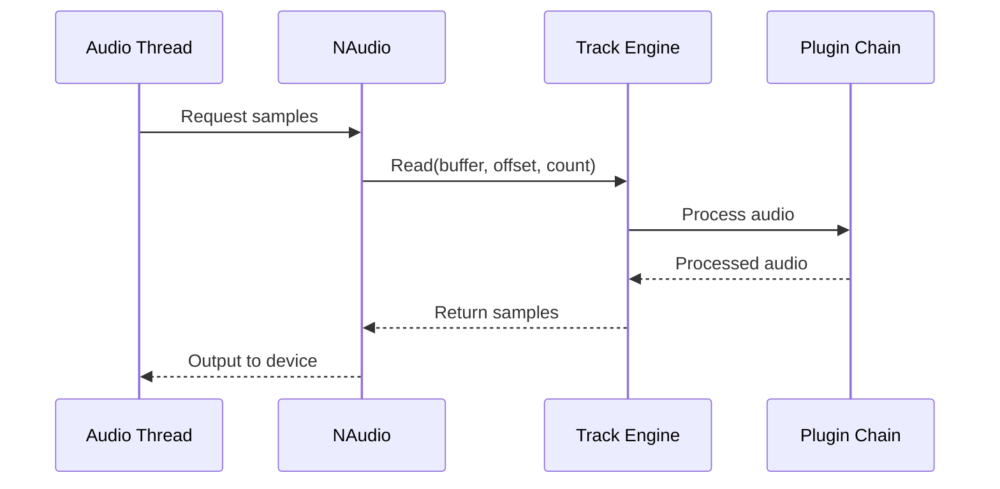

## Project Status

<Warning>
  Lumix is currently in **active development** and is considered a work-in-progress showcase project. The codebase is evolving rapidly.
</Warning>

From the repository README:

> This repository is intended to showcase progress, provide updates, and occasionally share work in progress versions of the project as it evolves.
> Pull requests or any sort of contribution isn't accepted for the time being since the DAW is still barebone.

While direct contributions are not currently accepted, you can still:

- Report bugs and issues
- Suggest features and improvements
- Build custom plugins for your own use
- Fork and experiment with the codebase

## Development Setup

### Prerequisites

<Steps>
  <Step title="Install .NET SDK">
    .NET 6 SDK is required for compilation.
    
    Download from [dotnet.microsoft.com](https://dotnet.microsoft.com/download/dotnet/6.0)
    
    Verify installation:
    ```bash
    dotnet --version
    ```
  </Step>
  
  <Step title="Clone the Repository">
    ```bash
    git clone https://github.com/ImAxel0/Lumix.git
    cd Lumix
    ```
    
    <Note>
      For latest commits, check the [Development](https://github.com/ImAxel0/Lumix/tree/Development) branch.
    </Note>
  </Step>
  
  <Step title="Platform Configuration">
    Project must be compiled as **x86** or **x64**.
    
    Configure in your IDE or via command line:
    ```bash
    dotnet build -c Debug --arch x64
    ```
  </Step>
  
  <Step title="Debug Mode Setup">
    If compiling in **debug mode**, remove the `LOCAL_DEV` constant define from the `.csproj` file:
    
    ```xml
    <!-- Remove or comment out this line -->
    <DefineConstants>LOCAL_DEV</DefineConstants>
    ```
  </Step>
</Steps>

### Building the Project

```bash
# Debug build
dotnet build -c Debug

# Release build
dotnet build -c Release

# Run the application
dotnet run --project Lumix
```

<Warning>
  **Expected Issues**: Source is provided as-is. Expect crashes, unfinished features, and partially working functionality during development.
</Warning>

## Development Environment

### Recommended IDEs

<CardGroup cols={2}>
  <Card title="Visual Studio 2022" icon="microsoft">
    Full-featured IDE with excellent C# and .NET support
    
    - IntelliSense and debugging
    - Built-in Git integration
    - NuGet package management
  </Card>
  
  <Card title="Visual Studio Code" icon="code">
    Lightweight editor with C# extension
    
    - Install C# Dev Kit extension
    - Integrated terminal
    - Git source control
  </Card>
  
  <Card title="JetBrains Rider" icon="terminal">
    Cross-platform .NET IDE
    
    - Advanced refactoring tools
    - Excellent code analysis
    - Performance profiling
  </Card>
</CardGroup>

### Required Extensions/Tools

- **C# Language Support** - Syntax highlighting and IntelliSense
- **Git** - Version control
- **NuGet** - Package management (usually built into IDEs)

## Codebase Structure

Understanding the project organization:

```
Lumix/
├── Clips/                    # Timeline clip implementations
│   ├── AudioClips/          # Audio clip handling
│   ├── MidiClips/           # MIDI clip handling
│   └── Renderers/           # Visualization (waveforms, MIDI notes)
├── FileDialogs/              # OS file dialogs
├── ImGuiExtensions/          # Custom ImGui controls
├── Plugins/                  # Plugin system
│   ├── BuiltIn/             # Native C# plugins
│   │   ├── Eq/              # Equalizer plugin
│   │   └── Utilities/       # Utility plugin
│   └── VST/                 # VST2 host implementation
├── Resources/                # Icons and fonts
├── SampleProviders/          # NAudio audio pipeline
├── Tracks/                   # Track implementations
│   ├── AudioTracks/
│   ├── MidiTracks/
│   ├── GroupTracks/
│   └── Master/
├── Views/                    # UI components
│   ├── Arrangement/         # Main timeline view
│   ├── Midi/                # Piano roll editor
│   ├── Preferences/         # Settings UI
│   └── Sidebar/             # File browser
└── Program.cs                # Application entry point
```

## Coding Standards

### General Guidelines

<AccordionGroup>
  <Accordion title="Naming Conventions">
    Follow standard C# naming conventions:
    
    ```csharp
    // Classes and public members: PascalCase
    public class AudioTrack
    {
        public string Name { get; set; }
        public void StartRecording() { }
    }
    
    // Private fields: _camelCase with underscore
    private string _name;
    private bool _isPlaying;
    
    // Local variables and parameters: camelCase
    public void Process(float[] buffer, int sampleRate)
    {
        int samplesRead = 0;
        float volume = 1.0f;
    }
    
    // Constants: PascalCase
    public const int DefaultSampleRate = 44100;
    ```
  </Accordion>
  
  <Accordion title="Code Organization">
    - One class per file
    - File name matches class name
    - Group related classes in folders
    - Use namespaces matching folder structure
    
    ```csharp
    // File: Tracks/AudioTracks/AudioTrack.cs
    namespace Lumix.Tracks.AudioTracks;
    
    public class AudioTrack : Track
    {
        // Implementation
    }
    ```
  </Accordion>
  
  <Accordion title="XML Documentation">
    Document public APIs with XML comments:
    
    ```csharp
    /// <summary>
    /// Processes audio through the plugin chain.
    /// </summary>
    /// <param name="input">The incoming unprocessed audio buffer</param>
    /// <param name="output">The processed audio buffer</param>
    /// <param name="samplesRead">Number of samples to process</param>
    public void Process(float[] input, float[] output, int samplesRead)
    {
        // Implementation
    }
    ```
  </Accordion>
</AccordionGroup>

### ImGui Usage Patterns

Lumix uses immediate-mode GUI with ImGui:

```csharp
public void Render()
{
    ImGui.Begin("Window Title");
    
    if (ImGui.Button("Click Me"))
    {
        // Handle button click
    }
    
    ImGui.SliderFloat("Volume", ref volume, 0f, 1f);
    
    ImGui.End();
}
```

<Tip>
  Render methods are called every frame (~60 FPS). Avoid heavy computations in render methods.
</Tip>

## Testing Your Changes

### Manual Testing

Since Lumix is still in early development:

<Steps>
  <Step title="Build and Run">
    ```bash
    dotnet run --project Lumix
    ```
  </Step>
  
  <Step title="Test Core Functionality">
    - Create audio and MIDI tracks
    - Load audio files and MIDI files
    - Add plugins to tracks
    - Test playback and recording
    - Verify UI interactions
  </Step>
  
  <Step title="Check for Crashes">
    Watch console output for exceptions and errors.
  </Step>
</Steps>

### Common Issues

<AccordionGroup>
  <Accordion title="Audio Driver Issues">
    If using ASIO4ALL, the process may not close cleanly:
    
    ```csharp Program.cs
    // Temporary workaround in Program.cs
    Process.GetCurrentProcess().Kill();
    ```
  </Accordion>
  
  <Accordion title="Plugin Loading Failures">
    VST plugins must be:
    - Valid VST2 format (not VST3)
    - Same architecture (x86/x64) as Lumix build
    - Located in configured plugin paths
  </Accordion>
  
  <Accordion title="ImGui Rendering Issues">
    Ensure graphics device is properly initialized:
    - Check Veldrid backend compatibility
    - Verify GPU drivers are up to date
  </Accordion>
</AccordionGroup>

## Understanding the Audio Thread

<Warning>
  **Thread Safety**: Audio processing runs on a separate thread. UI operations must not directly access audio buffers.
</Warning>

Audio flow:



Key principles:

1. **No allocations** in audio callbacks
2. **No locks** that could block audio thread
3. **Pre-allocate buffers** for audio processing
4. **Use lock-free patterns** for thread communication

## Plugin Development

For detailed plugin development guide, see [Building Plugins](/development/building-plugins).

Quick start:

```csharp
public class MyCustomPlugin : BuiltInPlugin, IAudioProcessor
{
    public override string PluginName => "My Plugin";
    public bool Enabled { get; set; } = true;
    
    public void Process(float[] input, float[] output, int samplesRead)
    {
        // Process audio samples
        for (int i = 0; i < samplesRead; i++)
        {
            output[i] = input[i] * 0.5f; // Example: reduce volume
        }
    }
    
    public T? GetPlugin<T>() where T : class => null;
    public bool DeleteRequested { get; set; }
    public bool DuplicateRequested { get; set; }
    
    public override void RenderRectContent()
    {
        // Render plugin UI controls
    }
}
```

## Reporting Issues

While contributions aren't accepted yet, you can report issues:

1. Check [existing issues](https://github.com/ImAxel0/Lumix/issues)
2. Provide detailed reproduction steps
3. Include system information:
   - OS and version
   - .NET SDK version
   - Build configuration (x86/x64, Debug/Release)
4. Attach logs and error messages

## Feature Requests

Before suggesting features, review the roadmap:

### Currently Working Features

- Audio and MIDI playback
- Track rendering and controls
- Built-in and VST2 plugin support
- Piano roll (partial)
- Grid snapping
- File preview

### Not Yet Implemented

- Audio clip editing view
- Audio clip warping
- Plugin grouping
- Track grouping
- Parameter automation
- **Project saving and loading**
- **Audio export**

<Note>
  Features marked in bold are critical for production use.
</Note>

## Learning Resources

### Understanding the Codebase

<CardGroup cols={2}>
  <Card title="Architecture Overview" icon="diagram-project" href="/development/architecture">
    Learn about Lumix system architecture
  </Card>
  
  <Card title="NAudio Documentation" icon="book" href="https://github.com/naudio/NAudio">
    Audio library used for playback and processing
  </Card>
  
  <Card title="ImGui Documentation" icon="window" href="https://github.com/ocornut/imgui">
    Immediate-mode GUI framework
  </Card>
  
  <Card title="VST SDK" icon="plug" href="https://github.com/obiwanjacobi/vst.net">
    VST.NET wrapper documentation
  </Card>
</CardGroup>

## Future Contribution Opportunities

While contributions aren't accepted now, the project may open up when:

- Core architecture stabilizes
- Essential features are implemented (save/load, export)
- Code quality reaches production standards
- Testing infrastructure is established

<Tip>
  Follow the repository for updates on when contributions will be accepted!
</Tip>

## Community

Stay updated:

- **GitHub Repository**: [ImAxel0/Lumix](https://github.com/ImAxel0/Lumix)
- **Development Branch**: [Development](https://github.com/ImAxel0/Lumix/tree/Development) - Latest commits
- **Issues**: Report bugs and track progress

## License

<Info>
  Check the repository's LICENSE file for usage terms and conditions.
</Info>

---

<Card title="Ready to Build Plugins?" icon="puzzle-piece" href="/development/building-plugins">
  Learn how to create custom audio processors and effects for Lumix
</Card>