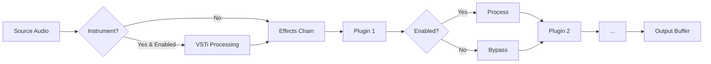

The plugin chain is the core audio processing pipeline in Lumix, managing the sequential processing of audio through multiple plugins. Each track has its own plugin chain implemented by the `PluginChainSampleProvider` class.

## Architecture

The plugin chain implements NAudio's `ISampleProvider` interface, integrating seamlessly with the audio engine:

```csharp
public class PluginChainSampleProvider : ISampleProvider
{
    private IAudioProcessor _pluginInstrument;
    private List<IAudioProcessor> _fxPlugins;
    private readonly ISampleProvider source;
    
    public WaveFormat WaveFormat => source.WaveFormat;
}
```

## Chain Structure

Each plugin chain consists of two distinct sections:

### 1. Instrument Slot

```csharp
private IAudioProcessor _pluginInstrument;
public IAudioProcessor PluginInstrument => _pluginInstrument;
```

- **Purpose**: Holds a single VSTi (VST Instrument)
- **Cardinality**: One instrument per track
- **Processing**: Generates audio from MIDI input
- **Replacement**: Adding a new instrument replaces the existing one

### 2. Effects Chain

```csharp
private List<IAudioProcessor> _fxPlugins = new() 
{ 
    new UtilityPlugin(), 
    new SimpleEqPlugin() 
};
public List<IAudioProcessor> FxPlugins => _fxPlugins;
```

- **Purpose**: Processes audio through multiple effects
- **Cardinality**: Multiple effects in sequence
- **Default Plugins**: Every track includes Utility and SimpleEq
- **Processing Order**: Effects are applied in list order

<Note>
The effects chain always includes a `UtilityPlugin` and `SimpleEqPlugin` by default, ensuring basic mixing controls are available on every track.
</Note>

## Plugin Management

### Adding Plugins

```csharp
public void AddPlugin(IAudioProcessor plugin)
{
    if (plugin is VstAudioProcessor vstPlugin && 
        vstPlugin.VstPlugin.PluginType == VstType.VSTi)
    {
        // Dispose of the current instrument if it exists
        if (_pluginInstrument != null && 
            _pluginInstrument is VstAudioProcessor currentVstInstrument)
        {
            currentVstInstrument.DeleteRequested = true;
            currentVstInstrument.VstPlugin.Dispose(
                vstPlugin.VstPlugin.PluginWindow.Handle != 
                currentVstInstrument.VstPlugin.PluginWindow.Handle);
        }
        
        _pluginInstrument = plugin;
    }
    else
    {
        _fxPlugins.Add(plugin);
    }
}
```

**Behavior:**
- **VSTi Plugins**: Replace the existing instrument and dispose of the old one
- **VST/Built-in Effects**: Append to the effects chain

<Warning>
Adding a new VSTi automatically disposes of the previous instrument. Ensure any necessary state is saved before replacing instruments.
</Warning>

### Removing Plugins

```csharp
public void RemovePlugin(IAudioProcessor target)
{
    if (target == _pluginInstrument)
    {
        if (target is VstAudioProcessor vstInstrument)
        {
            vstInstrument.DeleteRequested = true;
            vstInstrument.VstPlugin.Dispose();
        }
        _pluginInstrument = null;
    }
    else
    {
        _fxPlugins.Remove(target);
        
        if (target is VstAudioProcessor vstFxPlugin)
        {
            vstFxPlugin.DeleteRequested = true;
            vstFxPlugin.VstPlugin.Dispose();
        }
    }
}
```

**Cleanup Steps:**
1. **Mark for Deletion**: Sets `DeleteRequested = true`
2. **Dispose Resources**: Calls `Dispose()` for VST plugins
3. **Remove from Chain**: Clears instrument slot or removes from effects list

### Clearing All Plugins

```csharp
public void RemoveAllPlugins()
{
    // Dispose and remove instrument
    if (_pluginInstrument is VstAudioProcessor vstInstrument)
    {
        vstInstrument.DeleteRequested = true;
        vstInstrument.VstPlugin.Dispose();
    }
    _pluginInstrument = null;
    
    // Dispose and remove all effect plugins
    foreach (var fxPlugin in _fxPlugins.ToList())
    {
        _fxPlugins.Remove(fxPlugin);
        if (fxPlugin is VstAudioProcessor vstFxPlugin)
        {
            vstFxPlugin.DeleteRequested = true;
            vstFxPlugin.VstPlugin.Dispose();
        }
    }
}
```

<Info>
The `.ToList()` call creates a copy of the collection, allowing safe removal during iteration.
</Info>

## Audio Processing Pipeline

### Read Method

The `Read()` method is called by NAudio's audio engine on each buffer:

```csharp
public int Read(float[] buffer, int offset, int count)
{
    int samplesRead = source.Read(buffer, offset, count);
    
    // Process instrument if present
    if (_pluginInstrument != null)
    {
        if (_pluginInstrument.Enabled)
        {
            ProcessAudio(_pluginInstrument, ref buffer, offset, count, samplesRead);
        }
    }
    
    // Process effects chain
    foreach (var plugin in _fxPlugins.ToList())
    {
        if (!plugin.Enabled)
            continue;
        
        ProcessAudio(plugin, ref buffer, offset, count, samplesRead);
    }
    
    return samplesRead;
}
```

**Processing Flow:**

<Steps>
  <Step title="Source Audio">
    Read audio from the upstream `ISampleProvider` (e.g., audio file, MIDI track)
  </Step>
  <Step title="Instrument Processing">
    If a VSTi is present and enabled, process its audio output
  </Step>
  <Step title="Effects Chain">
    Apply each enabled effect plugin in sequence
  </Step>
  <Step title="Output">
    Return the fully processed buffer to the audio engine
  </Step>
</Steps>

### ProcessAudio Method

```csharp
private void ProcessAudio(IAudioProcessor plugin, ref float[] buffer, 
    int offset, int count, int samplesRead)
{
    // Create a temporary buffer to hold the processed data
    float[] tempBuffer = new float[count];
    
    // Copy the current buffer data to the temporary buffer
    Array.Copy(buffer, offset, tempBuffer, 0, samplesRead);
    
    // Process the data through the plugin
    plugin.Process(tempBuffer, tempBuffer, samplesRead);
    
    // Copy the processed data back to the original buffer
    Array.Copy(tempBuffer, 0, buffer, offset, samplesRead);
}
```

**Design Rationale:**
- **Temporary Buffer**: Ensures clean input/output separation
- **In-place Processing**: `tempBuffer` serves as both input and output to the plugin
- **Buffer Copying**: Safely handles offset positioning in the main buffer

<Note>
Plugins receive and write to the same buffer (`tempBuffer`) in their `Process()` method, enabling efficient in-place processing.
</Note>

## Signal Flow Diagram



## Bypass and Enable Control

Plugins can be bypassed without removing them from the chain:

```csharp
if (!plugin.Enabled)
    continue;  // Skip processing but keep in chain
```

**Benefits:**
- No need to remove/re-add plugins
- Maintains plugin order
- Preserves plugin settings
- A/B comparison of processed/unprocessed audio

### Toggle Method

The `IAudioProcessor` interface provides a convenience method:

```csharp
public void Toggle()
{
    Enabled = !Enabled;
}
```

## Thread Safety Considerations

### ToList() Protection

The plugin chain uses `.ToList()` when iterating during processing:

```csharp
foreach (var plugin in _fxPlugins.ToList())
```

**Purpose:**
- Creates a snapshot of the current plugin list
- Protects against collection modification during iteration
- Allows safe removal of plugins during processing

<Warning>
While `.ToList()` provides iteration safety, it doesn't prevent race conditions. Plugin addition/removal should ideally happen between audio callbacks, not during processing.
</Warning>

## Delete Requested Flag

Plugins use a `DeleteRequested` flag for deferred cleanup:

```csharp
if (DeleteRequested) return; // Skip processing
```

**Usage Pattern:**
1. Set `DeleteRequested = true` when removing a plugin
2. Plugin skips processing on next audio callback
3. Plugin is disposed and removed from the chain

**Rationale:**
- Avoids removing plugins mid-processing
- Ensures current audio callback completes safely
- Defers resource cleanup to a safe point

## Integration Example

Creating a plugin chain for a track:

```csharp
// Create the chain with an audio source
var pluginChain = new PluginChainSampleProvider(audioFileReader);

// Add a VST instrument (replaces silence with synth output)
var vstPlugin = new VstPlugin("path/to/synth.dll");
var vstProcessor = new VstAudioProcessor(vstPlugin);
pluginChain.AddPlugin(vstProcessor);

// Add additional effects
pluginChain.AddPlugin(new MyCustomEffect());

// Default Utility and SimpleEq are already present
// Pass the chain to the audio output
audioOutput.Init(pluginChain);
```

## Performance Characteristics

<AccordionGroup>
  <Accordion title="Buffer Copying Overhead">
    Each plugin in the chain requires buffer copying:
    - Copy to temp buffer
    - Plugin processing
    - Copy back to main buffer
    
    **Optimization**: Consider reducing the number of plugins for low-latency scenarios.
  </Accordion>
  
  <Accordion title="Processing Order Matters">
    Effects are applied sequentially:
    - Order affects the final sound
    - CPU-intensive plugins later in the chain process already-processed audio
    - Consider placing lighter effects first for optimal performance
  </Accordion>
  
  <Accordion title="Enabled Check Performance">
    Checking `Enabled` before processing:
    - Near-zero overhead for disabled plugins
    - Bypass without removing from chain
    - Instant enable/disable without plugin reload
  </Accordion>
</AccordionGroup>

## Related Topics

<CardGroup cols={2}>
  <Card title="VST Plugin Support" icon="plug" href="/plugins/vst-plugins">
    Learn how VST plugins integrate into the chain
  </Card>
  <Card title="Built-in Plugins" icon="sliders" href="/plugins/built-in-plugins">
    Explore the default plugins in every chain
  </Card>
  <Card title="Plugin Overview" icon="book" href="/plugins/overview">
    Understanding the IAudioProcessor interface
  </Card>
</CardGroup>